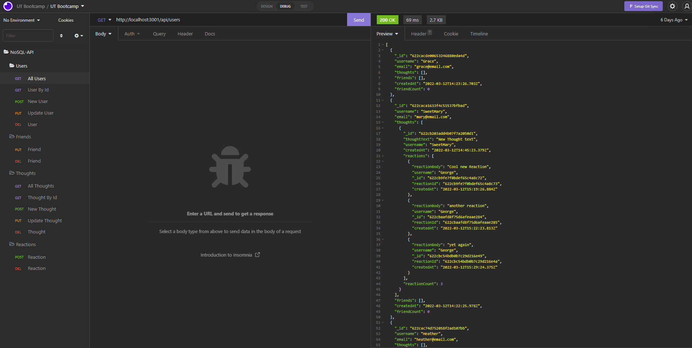
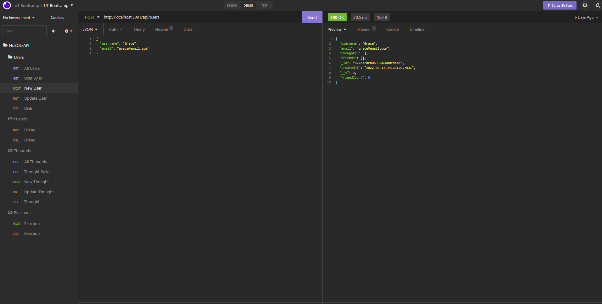
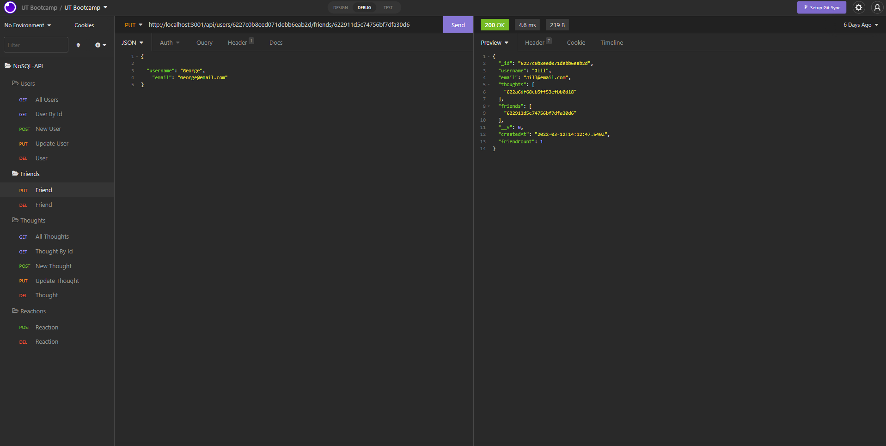
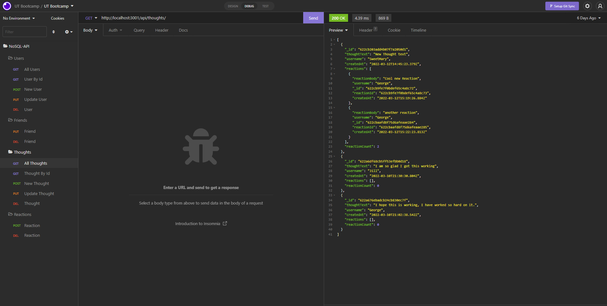
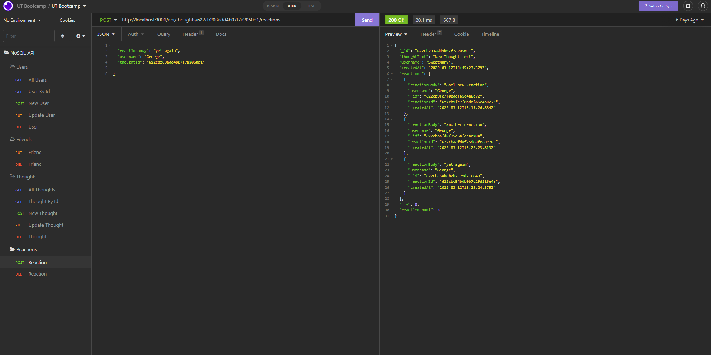

# NoSQL-social-network-API
  
  
  

## Description 

  * This is an API for a social network, using MongoDB. Users can share thoughts, react to their friends' thoughts, and have a list of their friends. This project uses Express.js, MongoDB, and Mongoose ODM. 

## Table of Contents

  * [Links](#links)
  * [Installation](#installation)
  * [License](#license)
  * [Images](#images)
  * #[Questions?](#questions?)

## Links

## Installation

  * Download this repository to your machine.
  * Open your CLI and navigate to the repository folder location.
  * Run `npm install` to get the packages installed to run this API.
  * Use insomnia or similar app to test the working routes. (api/users, api/users/userId, api/users/userId/friends, api/users/userId/friends/friendId, api/thoughts, api/thoughts/thoughtId, api/thoughts/thoughtId/reactions, api/thoughts/thoughtId/reactions/reactionId)

## License

  

  * This project is covered under [MIT](https://choosealicense.com/licenses/mit/)

## Images

  
   
   
   
   

## Questions?

  * Contact me at: CMJensen82@gmail.com
  * Github: https://github.com/CraigMJensen/
